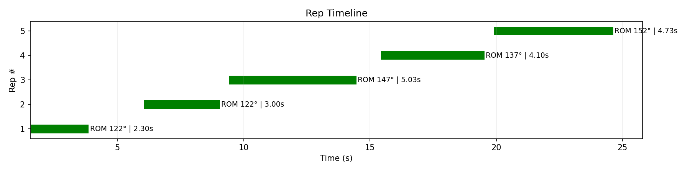

# Gym Pose Estimation

Gym Pose Estimation is an end to end computer vision system that detects, evaluates, and visualizes strength training repetitions (bench press, bicep curl, squat) from video. 
It uses pose estimation and joint angle analysis to segment reps, enforce form constraints, and generate annotated feedback and metrics.


## Demo
### Easy Calibration

| Bench Press (Easy) | Curl (Easy) | Squat (Easy) |
|-------------------|-------------|--------------|
|  |  |  |


### Strict Calibration

| Squat — Easy | Squat — Strict |
|--------------|----------------|
|  |  |

*All exercises support both easy and strict calibration profiles; squat is shown here as the most visually illustrative case.*


## Pipeline Overview

The system processes workout videos through the following stages:

1. **Pose Estimation**  
   Each video frame is processed to extract 2D body keypoints with confidence scores.

2. **Joint Angle Signal Construction**  
   Exercise-specific joint angles (e.g., elbow for bench/curl, knee for squat) are computed per frame and smoothed to form a continuous motion signal.

3. **Rep Segmentation**  
   Repetitions are segmented by detecting down -> up cycles in the joint angle signal using calibrated thresholds and temporal constraints.

4. **Per-Rep Evaluation**  
   Each segmented repetition is evaluated against calibration rules such as range of motion, duration, lockout, and stability.

5. **Outputs & Visualization**  
   The system generates annotated videos, per-rep metrics, diagnostic plots, and structured CSV/JSON outputs.
   

## Rep Evaluation Logic

Repetitions are evaluated using biomechanical constraints defined in calibration profiles.

For each exercise, the system checks a combination of:
- **Range of motion** (minimum and maximum joint angles)
- **Rep duration** (too fast or too slow)
- **Lockout and bottom position margins**
- **Hold requirements** at key phases of the movement
- **Stability and consistency** across the rep to reduce false positives


All evaluation thresholds are configurable via JSON calibration files, allowing the same movement to pass or fail under different strictness levels without code changes.


## How to Run

The system is executed through a single entry point (`main.py`) and supports different exercises and calibration profiles.


### Example

```bash
python main.py --input path/to/video.mp4 --exercise squat --calibration calibration_easy.json --debug
```


## Outputs & Diagnostics

For each processed video, the system produces multiple outputs designed for both feedback and interpretability:

- **Annotated video** with skeleton overlays, rep counts, and pass/fail feedback
- **Per-rep CSV and summary JSON** containing rep boundaries, duration, ROM, and evaluation outcomes
- **Diagnostic plots** to validate segmentation and evaluation logic, including:
  - Joint angle over time
  - Rep timeline (start/end of each repetition)
  - Range of motion per rep
  - Duration per rep

These visualizations are intended to help verify rep detection accuracy and understand why specific repetitions pass or fail.


### Joint Angle Signal

The joint-angle signal forms the core representation used for repetition segmentation and evaluation.


### Rep Segmentation Timeline

Each repetition is segmented from the continuous signal and visualized as a time interval.




### Rep-Level Metrics

Per-rep range-of-motion (ROM) values provide a quantitative view of movement quality.


*For clarity, the diagnostic plots shown above are from a single bench press run using the easy calibration profile; all exercises and calibration modes generate the same set of outputs.*


